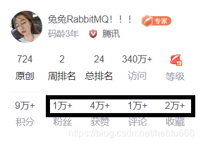
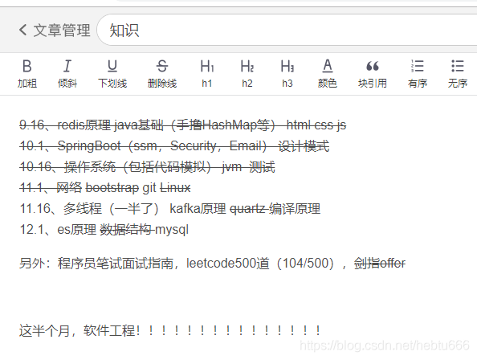

> [原文](https://fantianzuo.blog.csdn.net/article/details/115355061) 于 2021-03-31 17:06:18
> 
> 导语： 兔老大RabbitMQ 17级 现就职于腾讯

# 这篇不讨好任何人的回忆录，记录了我从双非学校到BAT/TMD六offer的原因

# 一、前言

在今年，我要毕业了，基本结束了大学生活，踏入了工作环境，觉得是时候写一个总结，给这段时光一个交代，也让多年后的我，还能回忆起这段经历，不忘初心。

想起小学作文有个结构叫“总分总”，那我就先来简单的总结一下这两个环境吧。

# 二、我的学校和工作

- 学校，说实话，出了省就很少人知道的学校，学生基本和一流互联网公司无缘，如果范围缩小到后端开发，我觉得可以把基本去掉。。
- 再说说公司，battmd所有公司都给我发了offer（信不信由你吧，之前有人不信我拿百度offer私信骂我，真的不至于，百度在我offer里只是中等吧），我最后选择了at里的好部门给的所谓大“special offer”，算是行业内比较好的去处了。

知道了出身和结果，那我就按时间详细说说，在大学三年不到的时间，我都做了哪些事吧，希望对未来的我，和对现在的你，都有一些启发。（不想看的直接到最后看总结）

# 三、过去

回忆还要从高考说起，“炸了炸了”，这就是我考完还有查分的内心想法。

> 我知道大部分人对于自己高考的印象都是“发挥失常”，这种自我认知超过现实的心理是很正常的，不过我还是要说一句，河北630只能上个不知名211真的正常吗，哭了哭了。河北绝对是，上所谓“名校”最难的省份，没有之一。

**到了大一，**学校教的第一门编程语言是python，我是挺喜欢这个专业的，但是奈何没人指点，也不知道干什么，因为当时我唯一知道的学习途径就是牛客网（导员做的新生大会上推荐的，感谢），就在大一上学期用python把牛客网当时最新的“16年校招算法题全集”刷了一遍，那是我第一次接触“算法”，它就是让我着迷。

紧接着牛客网推出了它历史上第一门算法课（现在已经改了很多版了），虽然左程云老师第一次讲课，但是我还是听的入迷，紧接着我全篇读了他写的书《程序员代码面试指南》，在我第三遍读那本书的“动态规划”一章的时候，大一下学期，河北省举办了“河北省大学生程序设计大赛”，说白了就是acm（或者ccpc）形式的省赛，和其他省一样，金牌可以去区域赛。我去拿了一个全省第七（还是第八来着），一共二十五个金牌，当时还挺激动的，不过也可见河北高等教育之弱，我一个大一没系统学过acm算法的人，都能拿前几名。

**到了大二，** 开始系统学习acm、参加比赛、学了一堆编程语言（至少写过学生管理系统这种玩意的就有cpp/Java/go/py/js等），也导致我校招找工作不怎么挑语言。当然最重要的是学了数据结构，积累到一定程度，我有了提笔把他们写下来的想法，于是我来csdn申请了一个博客号。

各位看到的这个博客号，**现在在CSDN总排名应该快前二十名了**，但是当时想写的原因很简单，学会了一点有难度的算法，想记录下来以后看，免得过两天就忘了，于是诞生了我的第一篇文章：

[傻子都能看懂的kmp](https://fantianzuo.blog.csdn.net/article/details/79822446)，

> 当然了，后来我发现傻子并看不懂，甚至一个正常程序员也要挺费劲的看才能看懂，我过两年再看甚至有点辣眼睛，但是这些都不重要，反正自己能看懂就好啦哈哈。

后来我发现，数据结构和算法越学越多，就有了我的第一篇【大总结】：

[【大总结1】数据结构与传统算法总结](https://fantianzuo.blog.csdn.net/article/details/83011422)

大二，我开始迷茫，对自己迷茫，对未来迷茫，对专业迷茫。

我们学院会分方向：有Java与安卓开发、大前端、测试、算法与大数据。

所有同学都开始纠结，我也开始纠结，我把所有方向都了解过，比较喜欢Java，但是上课后，发现大量时间都在教安卓，一直到大三还在学jsp这种老技术，我实在是等不下去了，了解了一下测试方向，觉得那些课还挺好玩的，各种测试和nosql，就转到测试方向了。

**到了大三，**又过了一年，我又学了数据结构、算法、语言基础、操作系统、关系数据库、NOSQL、网络/前端/项目基础知识、安全和测试、框架的学习、中间件和工具、设计模式和框架原理等等一堆玩意，越学越多，于是有了我第二篇总结：

[【大总结2】大学两年，写了这篇几十万字的干货总结](https://fantianzuo.blog.csdn.net/article/details/103438056)

这篇文章让我有了更高的流量，更多的粉丝，可是我自己却又陷入了一个冲突：**读研还是工作**。

# 四、冲突

其实这个话题，哪有什么正确答案，你去问别人根本没偶参考价值，因为只有这四种情况：

- 读研的人，混得不好，建议你别读研，浪费时间，去挣钱吧。
- 读研的人，混得好，建议你读研，你看我自己读研了才能混得这么好。
- 工作的人，混得不好，建议你千万别工作，去读研，你看我就是因为没学历，才混的这么差。
- 工作的人，混得好，建议你去工作，你看我挣这么多，读研白耽误时间。

> 每个人的建议都跳不出自己的圈子和实际情况和认知，所以我也不会给你任何的建议，因为我不配对陌生的你指点未来道路，我只是说一下我自己的选择。

我的父亲告诉我，千万不要本科毕业就去私企工作，因为他看到本地这些开发人员，工位像是黑网吧，五险一金最低限，天天加班，被老板骂，被产品骂，私企老板讨好一个小小的公务员等等，我不反对。

我的父亲的哥们告诉我，你的技术其实不值钱，学历值钱，你看我托人弄个公众号，功能特别多，那群人弄了好久，才几百块钱，所以你以后别写代码，先读研再说。

我的父亲的老师朋友告诉我，别去私企，你看我，在专科学校正式编制，基本不教课，天天混，没事写点小项目，开个小公司，学生免费劳动力，挣钱，不香吗。

我的母亲的哥哥告诉我，别去外面工作，我给你安排当兵，退休金比公务员还高。但是舅舅呀，在我们学校都是实在学不下去的才去当兵，我这小身子骨怕是受不了呢

我的导员告诉我爸，读研当然好，那些本科就工作的，没什么大发展。

我的父亲说：“你可以去当公务员、去当老师、去当兵、去考研，就是别去私企工作，在我们这个城市，私企员工是地位最低的。”

# 五、我的决定

其实也谈不上决定，因为我从大一开始，想法就没变过，我要去工作。

于是在某个时间，我和父亲发生了这样的对话：

> 我算了一笔账：“我们城市老师工资三千，公务员工资五千，当兵五千。我去工作一年五十万，我一年快比他们十年多了”

> 父亲：“你别做梦了，人家公务员五险一金多，平时福利多，算下来根本不是工资那么点。”

> 我：“我给他们算一年十万，可以了吧？，就算他们福利真的像别人说的特别特别多，我一年顶五年了。”

> 父亲：“你做什么梦呢，还五十万，我们这技术总监也才一万多。”

我把那些bat找人要求给他看，告诉他，这些技术在我看来并没有多难，我大一学哪几项，大二学哪几项，大三我去哪哪实习，我去哪哪工作，工资是多少。

**后来，我每年给他说的计划，都会少一年，因为我已经实现了今年的计划。**

终于，我拿着BAT的offer去给他看，他疯狂上扬的嘴角已经告诉我，我是最棒哒。

再后来，我对着正式offer给他念，月薪多少，奖金多少，股票多少，年薪多少。**他说，去飞吧。**

# 六、给你的忠告

**第一步，**尽早的确定你的短期目标和长期目标，经过我观察，我的所有同学，那些有所成就的同学，都是从大一就开始确定了自己的方向，并且为之努力的。

- 决定保研的同学，一节课都没有落下过，和所有老师都保持好的关系，保证平时分，学习最用功，最后保研到浙大
- 决定工作的学长，从大一就开始接政府的项目开始写，大二就已经两年工作经验，大三早就玩腻了业务去造轮子，最后拿了美团ssp+北京户口
- 决定公务员的学姐，大部门的活动都没缺过，随时在练表达能力书写能力，最后国考上岸

我的很多粉丝问我，兔兔，我是学c++还是Java还是py呀？这个数据结构用不用学呀？到底哪个方向好呀？等等等等，天天在纠结。过了半年，我发现他依旧在群里问。我就想骂你：“你问这么多你倒是去干啊？等你弄清楚哪个语言好，我早就用三种语言写了三个项目了”。请尽早的确定好了目标，

> 千万不要大一想公务员，大二想测试，大三想开发，大四又要当老师，你什么都干不好

**第二步、**坚持自己的所想，不要在路上听信其他的流言蜚语，其他的建议仅仅是建议，给建议的人并不会为你的人生负责。上文已经举例子很多了。

**第三步，**如果你确定你的路大概率是对的，请一定去执行它，**也就是特别强的执行力**，不被任何事和人所干扰，不择手段的前进！前进！就像三体中的韦德，章北海。前进四。

> 我放一下大三上学期自己弄的计划，最后按时完成的效果

注：9.16就是9.16到下个日期要完成的东西

# 七、要感谢的人

1）父亲：其实是不写代码的，但是在大学教网络课多年。我还记得大一去学校前，他把我拉到房间，教我拆装了一遍我家的台式机，给了我一些书，说了一些话，是我本专业第一个引路人。

2）孙导员：推荐了那个神奇的网站，让我有了点学习的方向，然后做了她的助理，她告诉我有很多学生来面试，让我通过的原因是：只有我准备了两整张纸的自我介绍，让我明白了态度有多重要。

> （说来奇怪，可能导员带的好或者是办公室风水好。她第一个助理去了腾讯玄武，第二个助理自学安全，拿了字节阿里一堆offer，我是第三个助理也拿了一堆sp offer）

3）丁老师：咋说呢，没事就喜欢找我回答问题，见面一顿商业互吹，是我的引路人。

4）学长：厂长/子旭/胜鹏等