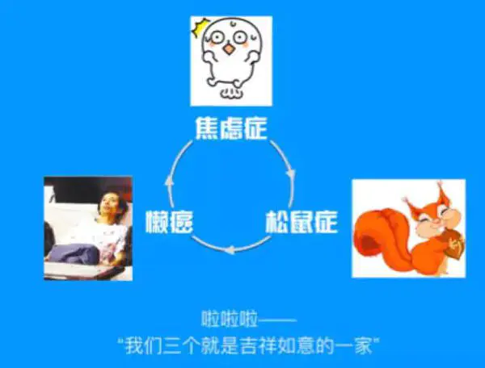
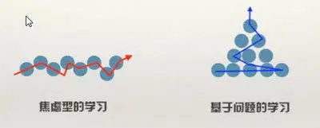
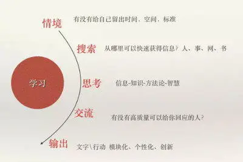

_文：古典 | 转自微信公众号古典古少侠（ID:gudian515）_

_先给你讲个故事，看你有没有中招：_  

有一天，你的朋友给你“知识装逼”了一个术语，牛！怎么知道的？——他推给你一个公众号。你开始关注，觉得哇！大神！牛逼！长见识！每天刷每天刷每天刷。很多问题也有了解决方法——按照这个进度，过3年就能理解宇宙终极奥义了。  

慢慢你有了十多个类似的号，承包了你从专业、生活、工作、跑步、减肥、饮食、情感关系……等等所有的领域——咳咳，有点看不过来的你决定提高效率碎片化学习！利用一切碎片时间，上地铁看一篇，吃饭时看一篇，睡前刷2篇。眼睛看不完，用音频刷，平时看不完，跑步还能刷——但是，还是刷不完！

还好有收藏功能，全他妈的收藏！这也叫“松鼠症”——不断攒不断攒不断攒……等到收藏超过100篇未读的时候，你终于发现收藏=永不再读，这让你沮丧。更让人沮丧的是，你好像距离写文章的大牛越来越远了——在你“学习”的这段时间，这100位大牛好像都更牛逼了一点。而且牛逼的人好像越来越多，观点越来越新，每天都有人用全新的玩法颠覆原来的牛人——哇，原来这才是对的！

别说宇宙奥义了，你对于生活有了深深的怀疑……再好的鸡汤也掩饰不了你日益的郁闷——确实这个世界LOW的就是刷了无数文章的你。你越来越焦虑，终于有一天，你彻底瘫痪了，对自己说，妈的为什么活得这么累？老子就是一个俗人，干嘛没事要成长？我要做一只猪，一坨肉，一个死尸——你开始转战娱乐、小说和短视频……

  

_中招的请举手_

更加让你想抽自己的是，过了几天你歇过来，你又开始了新一轮的循环——刷刷刷。

  

焦虑症-松鼠症-懒癌，本世纪三大绝症，其实是个死循环。

  

为什么会这样？因为，所有的当代人都面临两个问题——**信息超载和知识碎片化**。信息超载老话题不多说了，讲几个数据：  

> 全世界每天有4000本书出版，超过4亿个字；  
> 
> 纽约时报一天的文字量等于牛顿同时代的人一生的阅读量；
> 
> 一个专业领域，每天大概有200个公众号正在注册，有近1000篇文字正在产生……
> 
> 过去杂家、博物家在现代社会已经不可能存在，即使有，也干不过谷歌度娘。

  

知识的储存能力，人类早就被电脑完胜了，知识的搜索和链接能力，才是学习的核心竞争力。另一个趋势也很明显：知识碎片化。这个碎片化从3个方面开始——

首先时间和空间被打碎，移动手机允许你在三站地铁里听完一本书；

其次被打碎的是信息，如果你翻知乎、今日头条或者某个博客，你并不会像看一本书一样，知道前面一章讲什么的，后面即将讲什么，除了标题党，你根本对下一个博客、内容毫无预期，只能被动接受；

最糟糕的其实是知识结构碎片化——你并不知道是谁，在什么情况下，针对什么问题讲的这句话。所有的信息缺乏了上下文，就是废话。

比如说有段时间我刷管理类的文，你会发现在雷军、傅盛、彼得德鲁克、吴伯凡、马云、吴晓波……各位大佬针对同一个问题讲的内容完全不同。到底信哪个？

其实雷军讲的是互联网行业；傅盛讲的是小企业逆袭，他正在做投资；彼得德鲁克用管理在讲哲学；吴伯凡老师在讲中西方文化；马云老师在对大众励志；吴晓波其实是用管理谈财经——更重要的是，他们讲话的场合，时间点和对象你一无所知。如果一个人没有搜索能力，他不会知道背景；没有思考能力，不会知道为什么——这样单纯知道一句话，比不知道更糟糕。

  

  

把前面两个结论放一块，结果很清晰——时间空间碎片化确实能够提高学习的效率（其实也干不过电脑），而信息碎片化和知识结构碎片化带来的，则是学习效率的倒退和焦虑之源——因为他毁掉你的主动搜索能力和主动链接的能力，也就是深度思考的能力。

这就是碎片化的陷阱，极大的提高了并没有什么卵用的信息，而降低了最重要的独立思考的能力。

深度思考是件难事，也是件需要时间和空间的事，它远远比迅速点开另一个同样标题很好玩、内容很逗比的标题的文章难得多也长得多——但这个时候，90%的人会选择点开下一个话题——你的浅薄之路也从此开始。

这也形成一个上瘾机制——瞬间点开新话题能让你获得“哇我懂了”的廉价快感，但看的信息越多，就见到越多牛人的思想高度，你却无法越无法深度思考。为了抵御这种焦虑，你只好继续打开更多窗口，见证更多顶峰，然后更多焦虑。

饮鸩止渴，一直到瘫痪。

  

  

“我靠，我看了本书特好的书！”

“是吗是吗说什么的给我讲讲？”

“恩……特别好！特别牛！……我讲不出来，给个链接你自己看吧。”

是不是这样？

所以大部分的人学习，起初是为了解决问题，结果变成了逃避问题。他们越学越焦虑。

  

-----

  

什么是靠谱的学习方式？

观察下那些给你喂知识的专家们怎么做的。

他们都挺贼的——专注于一个小领域，以热点为关键词，搜索他们自己专业领域的内容；然后通过新的知识结构表达出来。

他们一方面无限度的降低了知识的门槛，其实反而被拉高的是你和他之间的距离。

知识创富时代，内容创业时代——无论你怎么说这个领域的弄潮儿，靠的都是这三个能力：**在某个专业领域的专注力；与热点、痛点和经典结合的搜索力；以及重新架构的链接能力。**

  

  

他们知道——即使你拿回来一百万个知识的砂砾，也只是沙漠，人们爱看的，是沙子集合成的金字塔——有组织的知识才是核心竞争力。有高度的知识，才有知识压强。

在你不断的在沙漠闲逛，他们自己的金字塔盖了起来。

  

----

  

怎么办呢？

下面是3个把抵御碎片化，让知识“零存整取”的方式：

**1. 学习的起点不是焦虑，而是问题**

李小龙当年刚回香港，在《欢乐今宵》上节目，节目组请来了一名太极拳拳师，想考验他能不能推到对方。拳师也摆好架子等他来推，结果李小龙一拳打在对方脸上。（此处有人准备直接拉到下面准备开骂“你他妈懂个屁太极”，这就是碎片化太厉害，完全不看上下文）

李小龙想表达的是——在真实的实战中，没有人会等你摆好架势，只冲着你规定的地方打过来。

学习也是一样——在真实生活中，环境和知识都变化太多——你不可能像学校里一样，系统的学好学完一门知识，然后坐在教室等着不超过知识点的考试。

大部分时间，生活会先给你一个考试，然后你根据问题，自己找出关键词，开始学习。

所以，学习的起点不是某人在朋友圈晒的一本书、推荐的一个微信文、或者这个行业的一个经典教材引发你的焦虑，而应该是你真实遇到的一个问题：

>   
> 
> 1. 通过不断的思考和对话，一直到能清晰的提出一个明确具体的问题——这时候，已经解决了一半。
> 
> 2. 把问题拆分出关键字，然后开始搜索认知资源。
> 
> 3. 找到你要到资源。
> 
>   

  

**2\. 扩充学习资源——人事网书**

找学习资源的能力，就是搜索能力。

大部分人找资源，第一反应是上网，或买本书。这很容易陷入困境，因为网络是个无底洞，这里翻翻那里看看，一不小心，2天都出不来。要把书里面的内容消化用完至少2周，前提还是你选对了书。

信息爆炸时代，最重要的不是增加信息，而是筛选和删除信息。

所以其实最好的方式是：

> 1. 从有经验的人开始，根据你提出的问题，给你清晰的建议、方向和边界；
> 
> 2. 找到行业对标，看看人家是怎么做的；
> 
> 3. 进一步用网络搜索资料和书的总结和评论，最后才是系统的看书。

  

**3\. 721法则：留出足够多的时间练习、思考和讨论**

行动学习理论认为，人要掌握一门技能，需要有10%的时间学习知识和信息，70%的时间练习和践行，还有20%的时间与人沟通和讨论。这个原则叫做721原则。

碎片化学习对于10%的信息接收非常有用，而剩下独处练习的70%和讨论的20%，则需要留出大量时间来系统学习——碎片化学习永远只是系统化学习的辅助。你需要留出足够多整块时间学习。

如果能看到这里，顺便说一句——我每周只写一篇不那么好读的干货文，一方面因为我懒，另一方面也因为我并不认为天天刷文能对人有所帮助，每周三晚上，如果能重新思考一个观点，做一点行动和思辨，帮助远远更大。（关于这个话题你有什么想说，记得在后面留言，做讨论的20%）

**4\. 输出倒逼输入**

如何能保证让自己思考有体系？

我看过、试过很多方法，最后最有效的只有一个，就是用输出倒逼输入。

你可以写文章、讲课、做PPT、做读书笔记、导图……只有一个要求——你的输出有结构。

你要先搭好图纸，设计出一个承重结构，然后铺钢筋，最后才放水泥和沙子。

先建立一个结构，你的知识和信息量会自动吸附在结构之上。时间一长，你会成为一个能根据结构链接知识的人。

很多人会说，我不会写该怎么办？

研究新建构主义的王竹立老师有一个观点——把知识零存整取：

>   
> 
> 第一步，叫做积件式写作，就是用ctrlc加ctrlV的方法，先拼出一篇符合逻辑的文字。（引用别人东西记得注明来源哈）
> 
> 第二步，进入个性化改写阶段，在第一步的基础上，你可以根据自己的个性化，写出自己的案例，自己的风格，自己的侧重点——现在网络上大部分的写作和讲课都是此类。
> 
> 第三步，创造性重构，在持续的前两步积累下，创造出全新的思路和模型。
> 
>   

  

大部分人的问题，都是看了第二第三步的文章，下结论说自己完全不适合写作，然后放弃。其实每个人都应该动笔从第一步做起——写作不是为了传播，至少为了思考和学习。

  

----

  

希望你建立一座自己的金字塔。